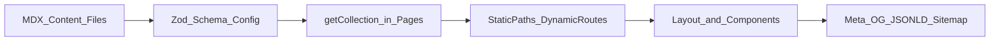
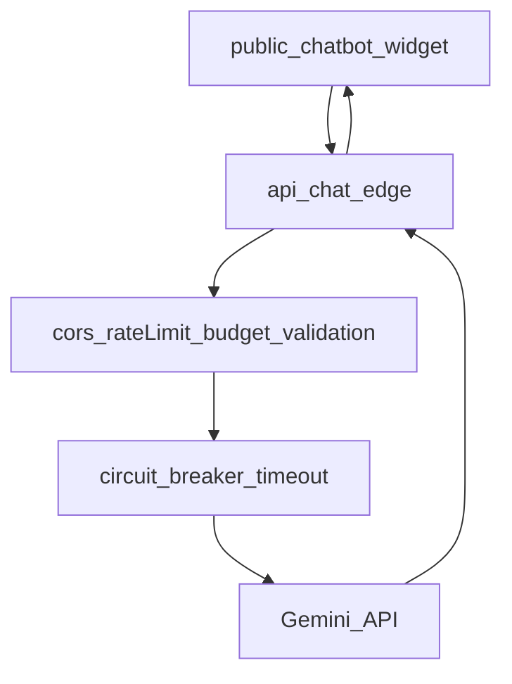

# Documentacion Arquitectura Actual

## 1) Resumen ejecutivo tecnico

Este sistema es un sitio Astro con arquitectura hibrida:
- **Frontend SSG/SSR de contenido** en `src/pages`, `src/layouts` y `src/components`.
- **Capa de datos estructurada** en `src/content` (MDX + validacion Zod).
- **Backend serverless puntual** en `api/chat.js` (Edge Function) para IA.
- **Sistema de estilos basado en tokens CSS** en `src/styles/tokens.css`, con conviviencia de utilidades Tailwind y CSS local por componente/pagina.

La estructura actual respeta mayormente la jerarquia `Schema -> Flow Logic -> API -> UI`, aunque hay deuda tecnica en consistencia de UI/estilos y cobertura de tests fuera de schemas.

---

## 2) Stack y configuracion de plataforma

### 2.1 Stack principal
- Astro `^4.16.0`
- Tailwind `^3.4.0` (`@astrojs/tailwind`)
- MDX (`@astrojs/mdx`)
- Zod (`astro:content` + validacion en `src/content/config.ts`)
- Vercel Analytics/Speed Insights
- Node test runner (`node:test`) + `tsx`

### 2.2 Configuracion relevante
- `astro.config.mjs`: integra Tailwind y MDX.
- `tailwind.config.mjs`: `darkMode: 'class'`.
- `package.json`:
  - `dev`: `astro dev`
  - `build`: `astro build`
  - `test`: `node --import tsx --test ./schemas/index.test.ts`
  - `typecheck`: `tsc --noEmit -p .`

---

## 3) Arquitectura por capas (estado actual)

## Capa 1: Schema (fuente de verdad de datos)

Archivo clave: `src/content/config.ts`.

Colecciones definidas:
- `projects`: titulo, descripciones ES/EN, estado, tags, icono, orden, destacado.
- `services`: titulo/descripcion ES/EN, icono, orden, href, roiFocus, priceFrom.
- `blog`: titulo/descripcion, pubDate, category, tags, draft, readingTime, coverImage, priority, vertical, etc.

Impacto arquitectonico:
- El frontmatter de MDX queda tipado y validado en build/dev.
- Evita consumo UI de contenido sin contrato.

## Capa 2: Flow Logic (orquestacion de contenido y rutas)

La logica de datos vive en `src/pages` usando `getCollection`.

Patrones observados:
- Filtros de negocio en pagina (ej. excluir `draft` en blog).
- Orden por metadatos (`order`, `pubDate`).
- Generacion de rutas dinamicas con `getStaticPaths`.
- Derivacion de taxonomias (categorias/tags) para navegacion y SEO.

Rutas principales:
- Estaticas: `/`, `/servicios`, `/talento`, `/blog`.
- Dinamicas:
  - `/blog/[slug]`
  - `/blog/categoria/[category]`
  - `/blog/etiqueta/[tag]`
- Endpoint de salida:
  - `/sitemap.xml` desde `src/pages/sitemap.xml.ts`.

## Capa 3: Containers/Composicion

En Astro, las paginas actuan como contenedores de composicion:
- `src/layouts/Layout.astro` centraliza head, metadatos base, scripts globales, JSON-LD global y slot de head por ruta.
- Paginas consumen datos y ensamblan componentes presentacionales (`Nav`, `BlogCard`, `ServiceCard`, `TaxonomyFilter`, `ContactForm`, etc.).

## Capa 4: API/Backend (serverless)

Backend identificado:
- `api/chat.js` (Edge Function): endpoint `POST /api/chat`.
- Utilidades de resiliencia:
  - `lib/circuit-breaker.js`
  - `lib/fetch-with-timeout.js`
  - `lib/image-upload.js` (integracion con Supabase, preparada para carga de imagenes).

Capas de control en `api/chat.js`:
- CORS y origen permitido.
- Validacion de metodo y `Content-Type`.
- Rate limiting por IP (en memoria por instancia Edge).
- Limite de tamano de body y sanitizacion de payload/history.
- Budget diario.
- Timeout + circuit breaker para Gemini.

Limitacion estructural:
- El estado de rate-limit/budget es in-memory por instancia Edge (no distribuido globalmente).

## Capa 5: UI (presentacion)

Componentes relevantes:
- `Nav.astro`: navegacion desktop/mobile, controles de tema/idioma/a11y.
- `BlogCard.astro`: tarjeta de blog con imagen, metadata y tags.
- `ServiceCard.astro`: tarjeta de servicios orientada conversion.
- `TaxonomyFilter.astro`: filtros por categoria/tag.
- `ContactForm.astro`: captura de leads.

Patron general:
- Pagina = obtiene y prepara datos.
- Componente = renderiza UI con props.

---

## 4) Integracion frontend-backend-datos

## 4.1 Flujo de datos de contenido (MDX -> UI)

Descripcion:
1. Se define schema en `src/content/config.ts`.
2. El contenido MDX se valida contra Zod.
3. Las paginas consultan con `getCollection`.
4. Se generan rutas/listados.
5. Se renderiza UI y se inyecta metadata/JSON-LD.

## 4.2 Flujo del chatbot (UI widget -> API Edge -> Gemini)

Descripcion:
- El widget en `public/chatbot/widget` envia historial a `/api/chat`.
- El endpoint aplica controles de seguridad/costo.
- La llamada a Gemini esta protegida por timeout y breaker.
- La respuesta vuelve al widget.

---

## 5) Estructura de paginas y componentes

## 5.1 Layout global

`src/layouts/Layout.astro` concentra:
- SEO base por ruta (title, description, canonical, OG, Twitter).
- JSON-LD global (`Person`, `ProfessionalService`).
- Slot `head` para inyeccion especifica de ruta.
- Scripts globales de:
  - tema (`nhTheme`)
  - idioma (`nhLang`)
  - accesibilidad (`nhA11y`)
  - carga de iframe de chatbot

## 5.2 Paginas

- `src/pages/index.astro`: homepage, consume `projects`.
- `src/pages/servicios.astro`: lista `services`, FAQ schema, conversion.
- `src/pages/talento.astro`: perfil tecnico + proyectos.
- `src/pages/blog/index.astro`: listado con filtros.
- `src/pages/blog/[slug].astro`: detalle articulo + JSON-LD `TechArticle` + `BreadcrumbList`.
- `src/pages/blog/categoria/[category].astro`: archivo por categoria.
- `src/pages/blog/etiqueta/[tag].astro`: archivo por tag.
- `src/pages/sitemap.xml.ts`: construccion dinamica de sitemap.

## 5.3 Componentes

- Navegacion: `Nav.astro`.
- Discovery/SEO interno: `BlogCard.astro`, `TaxonomyFilter.astro`.
- Conversacion B2B: `ServiceCard.astro`, `ContactForm.astro`.
- Marca/capacidades: `CapabilityCard.astro`, `ProjectDemo.astro`.

---

## 6) Arquitectura de estilos y UI/UX

## 6.1 Estructura de estilos

- `src/styles/tokens.css` define:
  - colores, tipografias, spacing, radios, componentes utilitarios.
  - modos `:root.light` y `:root.hc`.
  - `@fontsource-variable/inter` y `@fontsource-variable/outfit`.
- Tailwind esta configurado, pero no es la unica capa de estilos.

## 6.2 Estado real de implementacion visual

Situacion actual:
- Hay componentes/paginas con utilidades Tailwind.
- Hay multiples componentes/paginas con bloques `<style>` locales e inline styles.
- La UI es funcional y consistente en branding, pero con deuda de homogenizacion tecnica.

## 6.3 Accesibilidad/UX global

Implementado:
- `skip-link` al contenido principal.
- controles de alto contraste, escalado de fuente y reduccion de movimiento.
- `aria-label` y `aria-current` en navegacion.
- patron de lista nativa (`ul/li`) en nav y filtros.

Riesgo:
- coexistencia de muchos estilos locales dificulta mantener consistencia AA a largo plazo.

---

## 7) SEO/GEO tecnico actual

Fortalezas:
- Canonical, OG, Twitter, robots, hreflang desde layout.
- JSON-LD global + JSON-LD especifico en blog detail.
- Sitemap dinamico con rutas estaticas y dinamicas.
- Estructura semantica general (`main`, `section`, `article`, `aside`) presente en rutas clave.

Puntos a vigilar:
- En `BlogCard.astro` se usa `` cuando hay `coverImage`, en lugar de `Image` de `astro:assets`.
- Existen estilos inline/locales extensivos que pueden fragmentar criterios de a11y/SEO visual.

---

## 8) Backend y seguridad operacional

## 8.1 API de chat

`api/chat.js` incluye buenas practicas:
- validaciones en capas,
- protecciones de abuso (rate limit, body size, budget),
- control de resiliencia (timeout, breaker),
- CORS explicitado.

## 8.2 Integraciones externas

- Gemini: activa desde Edge function.
- Supabase: soporte en utilidades (`lib/image-upload.js`), no evidenciado como flujo principal en paginas actuales.

## 8.3 Consideraciones de escalabilidad

Para escalar volumen:
- migrar rate-limit/budget a almacenamiento compartido (KV/Redis/Durable Object equivalente).
- desacoplar configuracion de politicas por entorno.
- sumar observabilidad estructurada (metricas de errores 429/5xx, latencia, fallback ratio).

---

## 9) Estado de tests y calidad

## 9.1 Cobertura existente

Suite detectada:
- `schemas/index.test.ts`
- enfoque: validacion de contratos de datos (Zod schemas de dominio adicional).

## 9.2 Cobertura faltante

No se detectaron pruebas para:
- `api/chat.js` (integracion y casos de error).
- `lib/circuit-breaker.js`, `lib/fetch-with-timeout.js`, `lib/image-upload.js`.
- rutas/paginas Astro (smoke/e2e de render y SEO clave).
- CI automatizado visible para ejecutar pruebas en cada cambio.

---

## 10) Brechas y deuda tecnica priorizada

## Prioridad alta
- **Imagenes en blog cards**: reemplazar `` por `Image` o estrategia equivalente optimizada.
- **Cobertura API de chat**: agregar tests de integracion para 405, 415, 429, 500, fallback breaker.
- **Rate limit distribuido**: evitar dependencia in-memory por instancia Edge.

## Prioridad media
- **Unificacion de estrategia de estilos**: reducir mezcla CSS local/inline y converger a un patron unico.
- **Pruebas de SEO critico**: smoke de metadata/JSON-LD/sitemap en build.
- **Observabilidad operativa**: metricas de endpoint chat y alertas.

## Prioridad baja
- **Refactor incremental de componentes legacy de estilo**.
- **Documentacion de convenciones UI por componente** (tokens permitidos, niveles de headings, estados interactivos).

---

## 11) Roadmap corto recomendado (30-45 dias)

1. **Semana 1-2**: tests del endpoint `api/chat.js` + tests unitarios de utilidades de resiliencia.
2. **Semana 2-3**: correccion de imagenes de `BlogCard` y checklist SEO/a11y automatizable.
3. **Semana 3-4**: migracion progresiva de estilos locales criticos a una convencion comun.
4. **Semana 4-6**: rate limiting distribuido y monitoreo de costos/fallos de IA.

---

## 12) Inventario de archivos clave (trazabilidad)

Schema y contenido:
- `src/content/config.ts`
- `src/content/blog/*.mdx`
- `src/content/services/*.mdx`
- `src/content/projects/*.mdx`

Flow logic y rutas:
- `src/pages/index.astro`
- `src/pages/servicios.astro`
- `src/pages/talento.astro`
- `src/pages/blog/index.astro`
- `src/pages/blog/[slug].astro`
- `src/pages/blog/categoria/[category].astro`
- `src/pages/blog/etiqueta/[tag].astro`
- `src/pages/sitemap.xml.ts`

Layout/UI:
- `src/layouts/Layout.astro`
- `src/components/Nav.astro`
- `src/components/BlogCard.astro`
- `src/components/ServiceCard.astro`
- `src/components/TaxonomyFilter.astro`
- `src/components/ContactForm.astro`
- `src/components/CapabilityCard.astro`
- `src/components/ProjectDemo.astro`
- `src/styles/tokens.css`

Backend:
- `api/chat.js`
- `lib/circuit-breaker.js`
- `lib/fetch-with-timeout.js`
- `lib/image-upload.js`

Testing:
- `schemas/index.test.ts`

---

## 13) Conclusiones

La arquitectura actual tiene una base solida en contenido tipado (Zod + Astro Content), buen nivel de SEO tecnico en layout/rutas de blog y un backend Edge con protecciones relevantes para IA.  
El principal espacio de mejora esta en tres frentes: **homogeneidad de estilos/UI**, **escalabilidad operacional de la API de chat** y **ampliacion de cobertura de pruebas mas alla de schemas**.
