# Grafo de dependencias (importaciones)

**2026-03-24.** Solo importaciones entre **layouts**, **páginas** y **componentes** bajo `src/`. Flecha: *A importa B*.

## Tabla: componente → importa

| Archivo | Importa componentes / layout |
|---------|------------------------------|
| `layouts/Layout.astro` | `Footer`, `BackToTop` |
| `components/Footer.astro` | *(ningún otro componente)* |
| `components/BackToTop.astro` | *(ninguno)* |
| `pages/index.astro` | `Layout`, `Nav`, `HeroSection` |
| `pages/servicios.astro` | `Layout`, `Nav`, `PageHeroSection`, `ServiceCard`, `ContactForm`, `FAQAccordion`, … |
| `pages/talento.astro` | `Layout`, `Nav`, `CapabilityCard` |
| `pages/blog/index.astro` | `Layout`, `Nav`, `BlogCard`, `TaxonomyFilter` |
| `pages/blog/[slug].astro` | `Layout`, `Nav`, `TableOfContents`, `ArticleFooter`, `ShareBar`, `TableWrapper`, `SlideViewer`, `SectionSpacer` |
| `pages/blog/categoria/[category].astro` | `Layout`, `Nav`, `BlogCard`, `TaxonomyFilter` |
| `pages/blog/etiqueta/[tag].astro` | `Layout`, `Nav`, `BlogCard`, `TaxonomyFilter` |
| `pages/oferta/menu-digital.astro` | `Layout`, `Nav`, `ContactForm` |
| `pages/oferta/hub-creadores.astro` | `Layout`, `Nav` |
| `pages/dev/component-scripts-audit.astro` | `Layout`, `Nav`, `SlideViewer`, `ShareBar`, `TableOfContents` |

## Tabla: contenido MDX → componentes

| Archivo | Importa |
|---------|---------|
| `content/blog/arquitectura-sistemas-gran-escala.mdx` | `SectionSpacer` |
| `content/blog/diseniar-microservicios.mdx` | `SectionSpacer` |

## Hojas (no importan otros componentes del proyecto)

`HeroSection`, `Nav`, `ServiceCard`, `BlogCard`, `TaxonomyFilter`, `ContactForm`, `FaqSection`, `CapabilityCard`, `SlideViewer`, `SectionSpacer`, `ArticleFooter`, `ShareBar`, `TableOfContents`, `TableWrapper`, `ProjectDemo` *(no usado en páginas)*.

## Diagrama (resumen)

```mermaid
flowchart TD
  subgraph layout [Layout]
    L[Layout.astro]
    F[Footer.astro]
    B[BackToTop.astro]
  end
  L --> F
  L --> B

  subgraph pages [Páginas]
    IDX[index.astro]
    SER[servicios.astro]
    TAL[talento.astro]
    BLOGI[blog/index.astro]
    blogSlug["blog/[slug].astro"]
    CAT[blog/categoria]
    TAG[blog/etiqueta]
    OFM[oferta/menu-digital]
    OFH[oferta/hub-creadores]
    DEV[dev/component-scripts-audit]
  end

  IDX --> L
  SER --> L
  TAL --> L
  BLOGI --> L
  blogSlug --> L
  CAT --> L
  TAG --> L
  OFM --> L
  OFH --> L
  DEV --> L

  IDX --> Nav[Nav.astro]
  IDX --> Hero[HeroSection.astro]
  SER --> Nav
  SER --> SC[ServiceCard.astro]
  SER --> CF[ContactForm.astro]
  SER --> FAQ[FaqSection.astro]
  TAL --> Nav
  TAL --> Cap[CapabilityCard.astro]
  BLOGI --> Nav
  BLOGI --> BC[BlogCard.astro]
  BLOGI --> TF[TaxonomyFilter.astro]
  CAT --> Nav
  CAT --> BC
  CAT --> TF
  TAG --> Nav
  TAG --> BC
  TAG --> TF
  OFM --> Nav
  OFM --> CF
  OFH --> Nav
  DEV --> Nav
  DEV --> SV[SlideViewer.astro]
  DEV --> SB[ShareBar.astro]
  DEV --> TOC[TableOfContents.astro]

  blogSlug --> Nav
  blogSlug --> TOC
  blogSlug --> AF[ArticleFooter.astro]
  blogSlug --> SB
  blogSlug --> TW[TableWrapper.astro]
  blogSlug --> SV
  blogSlug --> SS[SectionSpacer.astro]
```

