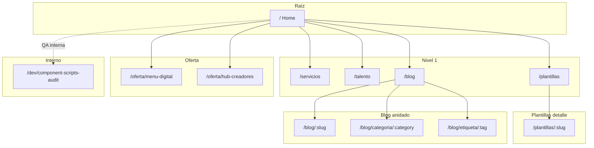

# Inventario de rutas, renderizado y mapa de páginas

Actualizado **2026-04-06** según `astro.config.mjs` (sin adapter Node: **sitio estático SSG** en build), `api/chat.js` (Vercel) y los archivos bajo `src/pages/`.

**Mantenimiento:** al agregar o renombrar una página en `src/pages/`, actualizar esta tabla y las secciones de endpoint/API si cambian rutas o comportamiento.

## Convenciones de la tabla

- **Nivel:** profundidad de la ruta pública (`/` = 0; cada segmento suma 1).
- **Estilos:** todas las páginas cargan `src/styles/tokens.css` vía [`Layout.astro`](../src/layouts/Layout.astro). **Scoped** = la página incluye un bloque `<style>` propio; **Tailwind** = sin `<style>` en la página, solo utilidades / clases globales.
- **Estado:** robots por defecto desde Layout (`index, follow`) salvo anotación; JSON-LD donde la página lo inyecta.

## Páginas Astro (`src/pages/`)

| Ruta pública                   | Nivel | Archivo                             | Modo                   | Contenido / propósito                                                                                                                                                                                  | `Nav` (`activePage`) | Componentes principales                                                                                               | Estilos             | Estado                                                                                 |
| ------------------------------ | ----: | ----------------------------------- | ---------------------- | ------------------------------------------------------------------------------------------------------------------------------------------------------------------------------------------------------ | -------------------- | --------------------------------------------------------------------------------------------------------------------- | ------------------- | -------------------------------------------------------------------------------------- |
| `/`                            |     0 | `index.astro`                       | Estática (SSG)         | Home: hero, proyectos destacados (`projects`), barra de stats, CTA dual (empresas / talento), showcase de proyectos.                                                                                   | `home`               | `HeroSection`; `getCollection('projects')`                                                                            | tokens + **scoped** | Indexable; sin JSON-LD específico de artículo                                          |
| `/servicios`                   |     1 | `servicios.astro`                   | Estática               | Hero fullscreen (`PageHeroSection` + `hero-servicios-derecha.webp`), catálogo desde content, tarjetas con pricing (`pricing.json`), FAQ (`FAQAccordion`), formulario de contacto.                      | `servicios`          | `PageHeroSection`, `ServiceCard`, `ContactForm`, `FAQAccordion`; `getCollection('services')`                          | tokens + **scoped** | Indexable                                                                              |
| `/talento`                     |     1 | `talento.astro`                     | Estática               | Perfil para reclutadores: hero con banner, capacidades, trayectoria, `LogoMarquee`, habilidades interpersonales, estudios, `ProjectCard` con `projects`, CTA a contacto.                               | `talento`            | `ProjectCard`, `LogoMarquee`, `getCollection('projects')`                                                             | tokens + Tailwind   | Indexable                                                                              |
| `/blog`                        |     1 | `blog/index.astro`                  | Estática               | Listado de posts publicados, filtro por categorías y etiquetas (`TaxonomyFilter`).                                                                                                                     | `blog`               | `BlogCard`, `TaxonomyFilter`; `getCollection('blog')`                                                                 | tokens + **scoped** | Indexable                                                                              |
| `/blog/:slug`                  |     2 | `blog/[slug].astro`                 | SSG + `getStaticPaths` | Artículo MDX: portada, cuerpo, TOC, barra compartir, pie con categoría/tags; slides embebidos según contenido. Una ruta por post no `draft`.                                                           | `blog`               | `TableOfContents`, `ShareBar`, `ArticleFooter`, `TableWrapper` (MDX), `SlideViewer`, `SectionSpacer`; `post.render()` | tokens + Tailwind   | Indexable; **JSON-LD** `TechArticle` + `BreadcrumbList` en slot `head`                 |
| `/blog/categoria/:category`    |     3 | `blog/categoria/[category].astro`   | SSG + `getStaticPaths` | Listado de posts filtrado por categoría; mismas tarjetas y filtro de taxonomía que el índice.                                                                                                          | `blog`               | `BlogCard`, `TaxonomyFilter`; `getCollection`                                                                         | tokens + **scoped** | Indexable                                                                              |
| `/blog/etiqueta/:tag`          |     3 | `blog/etiqueta/[tag].astro`         | SSG + `getStaticPaths` | Listado de posts filtrado por etiqueta.                                                                                                                                                                | `blog`               | `BlogCard`, `TaxonomyFilter`; `getCollection`                                                                         | tokens + **scoped** | Indexable                                                                              |
| `/en/blog/category/:category`  |     4 | `en/blog/category/[category].astro` | SSG + `getStaticPaths` | Wrapper EN del listado por categoría; reutiliza la página ES con labels, metadatos y enlaces resueltos por locale.                                                                                     | `blog`               | `BlogCard`, `TaxonomyFilter`; `getCollection`                                                                         | tokens + **scoped** | Indexable                                                                              |
| `/en/blog/tag/:tag`            |     4 | `en/blog/tag/[tag].astro`           | SSG + `getStaticPaths` | Wrapper EN del listado por etiqueta; reutiliza la página ES con labels, metadatos y enlaces resueltos por locale.                                                                                      | `blog`               | `BlogCard`, `TaxonomyFilter`; `getCollection`                                                                         | tokens + **scoped** | Indexable                                                                              |
| `/plantillas`                  |     1 | `plantillas.astro`                  | Estática               | Catálogo de plantillas (`landing-templates.ts`): hero, filtros por vertical, carrusel (`PlantillaCarouselCard`), planes (`PricingCard`), FAQ.                                                          | `servicios`          | `PlantillaCarouselCard`, `PricingCard`, `FaqSection`; script inline filtro + flechas carrusel                         | tokens + Tailwind   | Indexable; JSON-LD `ItemList` (solo `status === 'available'`, URL `/plantillas/:slug`) |
| `/plantillas/:slug`            |     2 | `plantillas/[slug].astro`           | SSG + `getStaticPaths` | Ficha por plantilla: descripción, features, CTA demo o “Próximamente”, enlace a contacto; JSON-LD `WebPage` + `canonical`.                                                                             | `servicios`          | `Layout`, `Nav`                                                                                                       | tokens + Tailwind   | Indexable                                                                              |
| `/oferta/menu-digital`         |     2 | `oferta/menu-digital.astro`         | Estática               | Oferta comercial: menú digital / landing desde precio en ARS, beneficios, `ContactForm` y CTA a WhatsApp.                                                                                              | `servicios`          | `ContactForm`                                                                                                         | tokens + Tailwind   | Indexable                                                                              |
| `/oferta/hub-creadores`        |     2 | `oferta/hub-creadores.astro`        | Estática               | Demo one-page tipo hub para creadores: bio, FAQ en acordeón, bloque para videos/enlaces (plantilla de producto).                                                                                       | `home`               | Solo `Layout` + `Nav` (markup en página)                                                                              | tokens + Tailwind   | Indexable                                                                              |
| `/en/offer/digital-menu`       |     3 | `en/offer/digital-menu.astro`       | Estática               | Wrapper EN de oferta menú digital / landing.                                                                                                                                                           | `servicios`          | `ContactForm`                                                                                                         | tokens + Tailwind   | Indexable                                                                              |
| `/en/offer/creator-hub`        |     3 | `en/offer/creator-hub.astro`        | Estática               | Wrapper EN del hub para creadores.                                                                                                                                                                     | `home`               | `Layout`, `Nav`                                                                                                       | tokens + Tailwind   | Indexable                                                                              |
| `/dev/component-scripts-audit` |     2 | `dev/component-scripts-audit.astro` | Estática               | Página interna (SV-07): dos instancias de `ShareBar`, `TableOfContents` y `SlideViewer` para validar scripts con `define:vars` / `getElementById`. No enlazar desde producción si no se desea exponer. | `blog`               | `SlideViewer`, `ShareBar`, `TableOfContents`                                                                          | tokens + Tailwind   | **`noindex, nofollow`** (meta en slot `head`)                                          |

## Endpoint de build

| Ruta           | Archivo          | Modo                                | Descripción breve                                                                                      |
| -------------- | ---------------- | ----------------------------------- | ------------------------------------------------------------------------------------------------------ |
| `/sitemap.xml` | `sitemap.xml.ts` | Respuesta generada en build (`GET`) | Lista URLs estáticas, fichas `/plantillas/:slug`, entradas de blog, categorías y tags para buscadores. |

## API serverless (fuera del árbol `src/pages`)

| Ruta (despliegue)               | Archivo       | Runtime                                                | Descripción breve                                                            |
| ------------------------------- | ------------- | ------------------------------------------------------ | ---------------------------------------------------------------------------- |
| `/api/chat` (convención Vercel) | `api/chat.js` | **Edge** (`export const config = { runtime: 'edge' }`) | Chat del widget: proxy a Gemini, rate limit y respuesta filtrada para la UI. |

No hay rutas `server` ni `hybrid` declaradas en `astro.config.mjs` en la versión actual del repo.

## Jerarquía del sitio (referencia visual)

Nota: `/dev/component-scripts-audit` no está enlazada desde la navegación principal; queda aislada como herramienta de QA.

## Enlaces relacionados

- [`docs/matriz-estado.md`](matriz-estado.md) — estado objetivo de componentes y subsistemas.
- [`docs/subsistemas/sistema-diseno.md`](subsistemas/sistema-diseno.md) — tokens y Tailwind.
- [`docs/plantillas.md`](plantillas.md) — catálogo `/plantillas` y fichas por slug.
- [`public/chatbot/docs/inventario-componentes.md`](../public/chatbot/docs/inventario-componentes.md) — inventario de componentes por archivo (actualizar si cambian imports).
