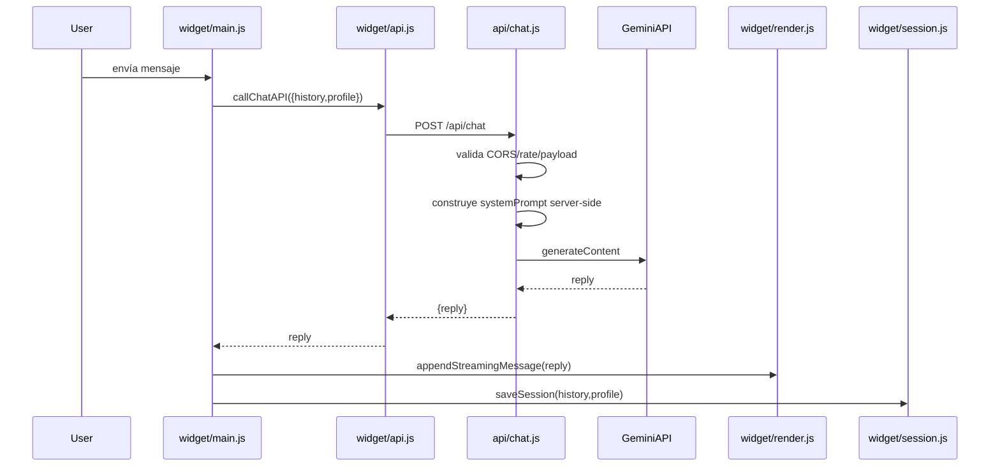

# Chatbot

## Alcance

- Widget en `public/chatbot/widget/` + datos en `public/chatbot/data/`.
- Backend BFF en `api/chat.js` (Vercel Edge); allowlist de `Origin` para preview acotada a hostnames del despliegue (`VERCEL_URL` / `VERCEL_BRANCH_URL` / `{VERCEL_PROJECT_NAME}.vercel.app`, ver [seguridad.md](./seguridad.md) SEC-004).
- Inyección global del iframe desde `src/layouts/Layout.astro` mediante script empaquetado por Astro, no inline, para respetar la CSP de preview/deploy.

## Flujo end-to-end

## Módulos

- `main.js`: estado, eventos, open/close, envío, quick replies.
- `api.js`: carga `config/services/articles` y llama `/api/chat`.
- `render.js`: DOM, markdown básico, streaming, CTAs, copy.
- `session.js`: persistencia en `sessionStorage` por perfil.
- `index.html`: bootstrap de tokens/tema + wiring de módulos.

## Demo viandas

- Habilitada por query `?demo=viandas`.
- Usa `config-viandas.json`, `services-viandas.json`, `articles-viandas.json`.
- Perfil allowlist en backend (`resolveDataProfile`).

## Integración con sitio

- `Layout.astro` inserta iframe fijo y escucha `postMessage` (`open`/`close`) desde el mismo script que controla el click-outside-to-close; ese bloque comparte estado `chatOpen` y referencia a `iframe.contentWindow`.
- El widget sincroniza `light/dark` y tokens desde el documento padre (incluye variables del sistema de botones: `--btn-primary-bg`, `--btn-primary-bg-hover`, `--btn-disabled-opacity`, `--color-on-accent`, `--text-lg` para `#send-btn`).

## Decisiones

- API key nunca en browser (proxy Edge).
- System prompt server-side con cache por perfil.
- Fallo “fail-silent”: fallback legible ante errores de proveedor.
- El inyector del iframe no usa `define:vars`; resuelve labels ES/EN en runtime desde `document.documentElement.lang` para que Astro lo emita como asset externo permitido por `script-src 'self'`.

## Deuda técnica

- `window.parent.origin` en `index.html` no es estándar; usar validación por `document.referrer`/handshake postMessage firmado.
- `document.addEventListener('click', ...)` global en `Layout.astro` para cerrar chat puede cerrar en interacciones no deseadas.

## Estado

✅ Documentado
